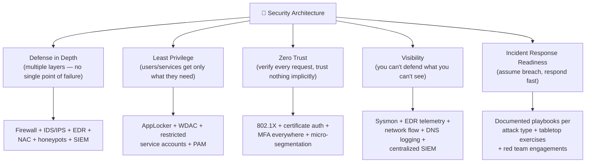

# 08 — Countermeasures

[⬅ Back to main index](../README.md)

> This section closes the loop on every attack covered in Modules 06a, 06b, and 06c — for every evasion technique, here is the defender's response. Each sub-section maps directly back to the evasion section it counters.

## Table of Contents
- [Defending Against IDS Evasion](#defending-against-ids-evasion)
- [Defending Against Firewall Evasion](#defending-against-firewall-evasion)
- [Defending Against Endpoint / AV Evasion](#defending-against-endpoint--av-evasion)
- [Defending Against NAC Evasion](#defending-against-nac-evasion)
- [Defending Against Antivirus Evasion](#defending-against-antivirus-evasion)
- [Security Architecture Best Practices](#security-architecture-best-practices)

---

## Defending Against IDS Evasion

These countermeasures address the techniques described in [06b — IDS Evasion](../06-evasion-and-bypass-techniques/06b-ids-evasion/README.md).

### Configuration and Tuning

```
✅ Keep IDS signature databases up to date at all times.
   → Most evasion techniques rely on signatures being stale or incomplete.
   → Automate updates: daily at minimum, hourly for high-value environments.

✅ Use a combination of signature-based AND anomaly-based detection.
   → Signature detection misses unknown/polymorphic attacks.
   → Anomaly detection catches behavioral deviations even with no matching signature.
   → Neither method alone is sufficient — layering is essential.

✅ Enable protocol anomaly detection.
   → Detects session splicing, invalid TCP flag combinations, urgency flag abuse,
     and malformed protocol sequences that signature engines miss.

✅ Enable fragment reassembly before inspection.
   → Never inspect individual fragments — only inspect fully reassembled streams.
   → Prevents ALL IP fragmentation and session-splicing evasion techniques.

✅ Normalize traffic before inspection (traffic normalization).
   → Strip or correct ambiguous packets before they reach the detection engine:
     - Remove duplicate segments
     - Drop packets with invalid checksums
     - Enforce protocol state machines (reject packets with invalid TCP state)
   → Snort/Suricata: enable the stream preprocessor/stream5 module.
   → This specifically counters: insertion attacks, evasion attacks, RST evasion,
     TTL manipulation, and desynchronization attacks.

✅ Set aggressive fragment reassembly timeouts.
   → Never let fragments wait longer than the target OS's timeout.
   → If in doubt, use a shorter timeout than any known OS — force the IDS to
     be more aggressive than the host, eliminating the TTL/timeout gap.

✅ Deploy the IDS inline (IPS mode) rather than passive.
   → A passive IDS can be overwhelmed by flooding — the traffic still reaches the target.
   → An inline IPS can drop packets before they arrive — flooding the IPS crashes it but
     the target is at least protected.
```

### Capacity and Resilience

```
✅ Size the IDS hardware to handle 150–200% of normal peak traffic volume.
   → Flooding attacks succeed only when the IDS runs out of processing capacity.
   → Oversized hardware (CPU, RAM, NIC) directly counters the flooding technique.

✅ Deploy redundant IDS sensors (active-active or active-passive failover).
   → A DoS attack against a single sensor takes down monitoring for that segment.
   → Redundant sensors mean the attacker must simultaneously overwhelm both.

✅ Protect the central log server / SIEM from DoS.
   → Rate-limit inbound syslog/event traffic.
   → Deploy the log server on an isolated management network the attacker cannot reach.
   → Configure the IDS to store events locally (ring buffer) if the central server
     becomes unreachable — prevents log loss during a DoS.

✅ Implement alert correlation and automatic threshold tuning.
   → Counters false positive flooding (the attacker's goal is to cause alert fatigue).
   → SIEM rules: suppress repeated identical alerts (dedup); escalate only after N
     alerts of the same type in a sliding window.
   → Auto-throttle: if alert rate exceeds X/minute, escalate to CRITICAL and page SOC.
```

### Encryption and Obfuscation Detection

```
✅ Deploy SSL/TLS inspection (man-in-the-middle decryption at the gateway).
   → The single most effective counter to the "just encrypt it" evasion technique.
   → Requires a trusted internal CA certificate distributed to all endpoints.
   → Trade-offs: significant performance overhead; privacy implications; certificate
     pinning in some apps breaks this.

✅ Implement DNS monitoring and NXDOMAIN ratio alerting.
   → DGA malware generates many failed DNS lookups (NXDOMAIN responses).
   → Alert on: hosts generating >20 NXDomain responses per minute.
   → Block known DGA domain patterns with Cisco Umbrella / Palo Alto DNS Security.

✅ Enable JA3/JA3S TLS fingerprinting on the IDS.
   → Even without decrypting TLS, fingerprint the TLS handshake itself.
   → Known malware families have characteristic JA3 fingerprints.
   → Suricata: ja3.hash field is available in eve.json logs.

✅ Monitor for encoded command execution (Base64 in PowerShell, etc.).
   → Windows Event ID 4104 (PowerShell Script Block Logging) captures all scripts
     before execution — AMSI decodes them before this point.
   → Configure: PowerShell Script Block Logging via GPO.
```

### Specific Technique Countermeasures

| IDS Evasion Technique | Specific Countermeasure |
|---|---|
| Insertion Attack | Normalize traffic — reject packets with bad checksums *before* inspection |
| Evasion Attack | Reassemble TCP streams fully before applying signatures |
| Session Splicing | Set minimum reassembly timeout > attacker inter-fragment delay |
| TTL Attack | Normalize TTL — enforce consistent TTL for all packets in a session |
| Urgency Flag | Configure IDS to honor URG flag exactly as the target OS does |
| Invalid RST | Verify TCP checksums before honoring RST; use stateful tracking |
| Polymorphic Shellcode | Use ML/behavioral detection instead of byte signatures |
| Unicode Evasion | Normalize all Unicode to canonical form before pattern matching |
| Fragmentation | Reassemble before inspection (non-negotiable) |
| Desynchronization | Strict stateful tracking; verify sequence numbers |
| DGA | DNS monitoring, ML domain classification, NXDOMAIN rate limiting |
| Flooding | Oversized hardware; rate-limiting upstream; inline IPS |
| False Positive Flood | Alert correlation, dedup, threshold tuning |

---

## Defending Against Firewall Evasion

These countermeasures address the techniques in [06a — Firewall Evasion](../06-evasion-and-bypass-techniques/06a-firewall-evasion/README.md).

### Core Firewall Hardening

```
✅ Implement a default-deny (whitelist) policy.
   → The firewall should block everything by default.
   → Only explicitly permitted traffic is allowed.
   → Never start with "allow all, deny some" — invert the default.

   # iptables example: default-deny policy
   sudo iptables -P INPUT DROP
   sudo iptables -P FORWARD DROP
   sudo iptables -P OUTPUT ACCEPT   # or DROP and whitelist outbound too

✅ Block all inbound traffic unless explicitly required.
   → Enumerate every service that legitimately needs inbound access.
   → Create specific ALLOW rules only for those services.
   → Everything else: DROP (silently) rather than REJECT (which confirms the host exists).

✅ Implement egress filtering — not just ingress.
   → Most firewalls focus on blocking inbound traffic.
   → Egress (outbound) filtering stops: data exfiltration, C2 callbacks,
     ICMP/DNS/HTTP tunneling, and BITS abuse.
   → Block all outbound traffic by default; whitelist only required destinations.

✅ Block source-routed packets at the perimeter router.
   → On Cisco IOS: no ip source-route
   → On Linux: sysctl -w net.ipv4.conf.all.accept_source_route=0
                sysctl -w net.ipv6.conf.all.accept_source_route=0
   → Make permanent in /etc/sysctl.conf

✅ Enable anti-spoofing rules (RFC 3704 / BCP 38 ingress filtering).
   → Drop inbound packets with source IPs that should never arrive from outside:
     - RFC 1918 private ranges (10.0.0.0/8, 172.16.0.0/12, 192.168.0.0/16)
     - Loopback (127.0.0.0/8)
     - Link-local (169.254.0.0/16)
     - Multicast (224.0.0.0/4)
     - Your own IP address ranges (prevent spoofed "internal" traffic from outside)

   # iptables: drop incoming packets claiming to be from private ranges
   sudo iptables -A INPUT -i eth0 -s 10.0.0.0/8 -j DROP
   sudo iptables -A INPUT -i eth0 -s 172.16.0.0/12 -j DROP
   sudo iptables -A INPUT -i eth0 -s 192.168.0.0/16 -j DROP
   sudo iptables -A INPUT -i eth0 -s 127.0.0.0/8 -j DROP

✅ Deploy stateful inspection — never use stateless packet filtering alone.
   → Stateless filtering cannot detect ACK tunnel attacks, session desynchronization,
     or invalid RST sequences.
   → Enable connection tracking (conntrack) on all Linux firewalls.
   → Use iptables -m state --state ESTABLISHED,RELATED for return traffic.
```

### Tunneling and Protocol Abuse Countermeasures

```
✅ Block or strictly rate-limit ICMP at the perimeter.
   → Allow only ICMP types legitimately needed for operations:
     - Type 3 (Destination Unreachable) — needed for PMTU discovery
     - Type 11 (Time Exceeded) — needed for traceroute
     - Type 8/0 (Echo/Echo Reply) — optional; can be blocked without breaking connectivity
   → Block all other ICMP types outright.
   → This directly prevents ICMP tunneling (PingRAT, ptunnel-ng).

   # iptables: allow only specific ICMP types
   sudo iptables -A INPUT -p icmp --icmp-type 3 -j ACCEPT
   sudo iptables -A INPUT -p icmp --icmp-type 11 -j ACCEPT
   sudo iptables -A INPUT -p icmp -j DROP

✅ Use DNS-over-HTTPS (DoH) or DNS-over-TLS (DoT) with a trusted recursive resolver.
   → Forces all DNS traffic through a monitored, controlled resolver.
   → The resolver can detect DGA and DNS tunneling (iodine, dnscat2).
   → Block direct DNS (UDP 53) to any external resolver that isn't your approved one.

   # Block outbound DNS to any resolver except your approved one
   sudo iptables -A OUTPUT -p udp --dport 53 ! -d 192.168.1.1 -j DROP
   sudo iptables -A OUTPUT -p tcp --dport 53 ! -d 192.168.1.1 -j DROP

✅ Inspect HTTP/HTTPS traffic for tunneling.
   → HTTP tunneling (HTTPort/Chisel) generates HTTP traffic with:
     - Unusually long sessions
     - Very high data volume for a "web browsing" session
     - Binary/encrypted-looking payloads in POST bodies
   → Deploy a web proxy (Squid, Zscaler, Netskope) with SSL inspection.
   → Alert on: HTTP sessions exceeding 1GB of transfer; binary data in unexpected content types.

✅ Block outbound SSH (port 22) unless explicitly required.
   → SSH tunneling is only possible if SSH is allowed outbound.
   → Allow SSH only from management hosts to specific jump servers.
   → If SSH must be allowed broadly, deploy a bastion/jump host that terminates all
     SSH sessions — block direct SSH from endpoints to the internet.

✅ Implement DNS monitoring for tunneling indicators.
   → DNS tunneling signatures:
     - DNS query labels longer than 50 characters
     - High entropy in query labels (random-looking subdomains)
     - Very high query rate to a single domain
     - TXT/NULL/CNAME record types queried frequently (tunneling uses these for data)
   → Tools: PassiveDNS, Zeek with the dns.log, Cisco Umbrella.

✅ Monitor for BITS abuse.
   → Audit all BITS jobs: Get-BitsTransfer -AllUsers
   → Alert on BITS transfers to external/unusual destinations
   → Review: Microsoft-Windows-Bits-Client/Operational event log
   → Use GPO to restrict BITS:
       Computer Configuration → Administrative Templates → Windows Components →
       Background Intelligent Transfer Service (BITS)
```

### Application Layer and WAF Hardening

```
✅ Deploy a Web Application Firewall (WAF) in front of all public-facing web apps.
   → Counters XSS, SQL injection, parameter tampering even when other layers fail.
   → Use managed rule sets (OWASP CRS) plus custom rules for your application.
   → Enable "learning mode" for 2-4 weeks to baseline normal traffic before enforcing.

✅ Normalize all input at the application layer.
   → Decode Unicode/URL encoding before comparing against allow/block rules.
   → A WAF that compares against encoded input misses Unicode evasion attacks.
   → PHP example: htmlspecialchars() before output; use prepared statements for SQL.

✅ Implement a strict Content Security Policy (CSP) header.
   → Prevents HTML smuggling and XSS by restricting which scripts can execute.
   → Start with: Content-Security-Policy: default-src 'self'; script-src 'self'
   → No 'unsafe-inline' — inline scripts (HTML smuggling's execution vector) are blocked.

✅ Remove or falsify service banners.
   → Prevents banner grabbing from revealing exact versions for targeted exploits.
   Apache: ServerTokens Prod
           ServerSignature Off
   Nginx:  server_tokens off;
   SSH:    Banner /etc/ssh/banner_text (set to something generic or empty)

✅ Implement HTTP security headers.
   → X-Frame-Options: DENY             (prevent clickjacking)
   → X-Content-Type-Options: nosniff   (prevent MIME-type sniffing)
   → Strict-Transport-Security: max-age=31536000; includeSubDomains (force HTTPS)
   → Referrer-Policy: no-referrer      (prevent information leakage)
```

---

## Defending Against Endpoint / AV Evasion

These countermeasures address the techniques in [06c — NAC and Endpoint Evasion](../06-evasion-and-bypass-techniques/06c-nac-and-endpoint-evasion/README.md).

### Macro and Script Execution Controls

```
✅ Disable Office macros by default via Group Policy.
   → GPO path: User Configuration → Administrative Templates →
     Microsoft Word/Excel/PowerPoint → Trust Center → Disable all macros without notification
   → For environments that legitimately need macros: require digital signing.
   → Block execution of .js, .jse, .vbs, .vbe, .wsf, .wsh file types via GPO:
       File Type Association policies → remove default handler for these extensions

✅ Enable Attack Surface Reduction (ASR) rules on Windows Defender.
   → Specifically relevant rules:
     - Block Office applications from creating child processes
     - Block Office applications from injecting code into other processes
     - Block JavaScript or VBScript from launching downloaded executable content
     - Block execution of potentially obfuscated scripts
     - Block Win32 API calls from Office macros

   # PowerShell: enable ASR rules
   Set-MpPreference -AttackSurfaceReductionRules_Ids <rule-GUID> `
                    -AttackSurfaceReductionRules_Actions Enabled

✅ Enable PowerShell Script Block Logging + Transcription.
   → Script Block Logging (Event ID 4104) captures all PowerShell code before execution.
   → AMSI decodes obfuscated/Base64 scripts before logging — evasion fails here.
   → GPO: Computer Configuration → Administrative Templates →
         Windows Components → Windows PowerShell →
         Turn on PowerShell Script Block Logging → Enabled

✅ Enforce PowerShell Constrained Language Mode (CLM).
   → Limits PowerShell to a safe subset of functionality — blocks .NET method calls,
     COM object creation, and many reflection-based AMSI bypass techniques.
   → Deploy via: AppLocker or Windows Defender Application Control (WDAC).
   → Test: [System.Runtime.InteropServices.Marshal]::GetDelegateForFunctionPointer
     → should throw an error in CLM
```

### Memory Protection and API Monitoring

```
✅ Enable Credential Guard (Windows 10 Enterprise +).
   → Isolates LSASS in a virtualized container — prevents credential dumping
     (Mimikatz cannot access credentials in a Credential Guard-protected environment).

✅ Enable Memory Integrity (Hypervisor-Protected Code Integrity / HVCI).
   → Prevents unsigned kernel code from running — counters kernel rootkits like KoviD.
   → Settings → Windows Security → Device Security → Core Isolation → Memory Integrity.
   → Note: can cause compatibility issues with older drivers.

✅ Deploy an EDR solution with kernel-level monitoring.
   → User-space EDR hooks can be cleared (see memory hook clearing technique).
   → Kernel-level EDR (e.g., CrowdStrike's kernel module, SentinelOne's kernel agent)
     cannot be cleared from user space.

✅ Monitor ETW (Event Tracing for Windows) for patching attempts.
   → If an attacker patches EtwEventWrite, ETW events for that process stop.
   → Alert on: processes where ETW events suddenly disappear while the process is running.
   → Use: Microsoft-Windows-Threat-Intelligence ETW provider (requires kernel access).

✅ Enable and monitor Windows Kernel Audit.
   → Audit Policy: Object Access → Audit Kernel Object
   → Detect process injection: Event IDs 4663 (object access), 4688 (process creation),
     8 (CreateRemoteThread — Sysmon), 10 (ProcessAccess — Sysmon).

✅ Deploy Sysmon with a comprehensive configuration.
   → Sysmon captures: process creation (with full command line), network connections,
     file creation, registry changes, driver loads, and remote thread creation.
   → Use SwiftOnSecurity's Sysmon config as a baseline:
     https://github.com/SwiftOnSecurity/sysmon-config

   # Install Sysmon with a config file
   sysmon64.exe -accepteula -i sysmonconfig.xml

   # Update config without reinstalling
   sysmon64.exe -c sysmonconfig.xml
```

### Application Whitelisting

```
✅ Implement Application Whitelisting via Windows Defender Application Control (WDAC).
   → Only signed, approved applications can execute.
   → Counters: DLL hijacking (blocks unsigned DLLs), LoLBins misuse (can restrict
     allowed arguments for trusted binaries), CPL sideloading.
   → Start in "Audit Mode" — log violations without blocking for 30 days.
   → Then switch to "Enforcement Mode".

✅ Restrict which directories code can execute from.
   → AppLocker default rules: allow execution from %PROGRAMFILES%, %WINDOWS%, and
     signed scripts. Block execution from: %TEMP%, %APPDATA%, Downloads.
   → Most malware drops payloads to %TEMP% or %APPDATA% — this policy catches them.

✅ Block known LOLBins with suspicious arguments via WDAC / AppLocker.
   → certutil -urlcache → block certutil with -urlcache argument
   → mshta.exe <URL> → block mshta with any http/https argument
   → regsvr32 /i:http → block regsvr32 with /i:http
   → References: https://lolbas-project.github.io/ for full LoLBins catalog
```

---

## Defending Against NAC Evasion

These countermeasures address the techniques in the NAC section of [06c](../06-evasion-and-bypass-techniques/06c-nac-and-endpoint-evasion/README.md#nac-bypass-techniques).

### VLAN and Switch Hardening

```
✅ Disable DTP (Dynamic Trunking Protocol) on all non-trunk ports.
   → Cisco IOS on each access port:
     interface GigabitEthernet0/1
       switchport mode access
       switchport nonegotiate        ← disables DTP — cannot be coerced into a trunk
       switchport access vlan 10
       spanning-tree portfast
       spanning-tree bpduguard enable

✅ Use a dedicated native VLAN that carries no host traffic.
   → The classic double-tagging attack exploits the native VLAN.
   → If VLAN 999 is the native VLAN and no user is ever on VLAN 999,
     the double-tagging exploit has no exploitable native VLAN to abuse.

✅ Enable BPDU Guard on all access ports.
   → Prevents an attacker from connecting a rogue switch and negotiating trunk.
   → Cisco IOS: spanning-tree bpduguard enable (per interface)
   → Or globally: spanning-tree portfast bpduguard default

✅ Implement 802.1X port authentication on every switch port.
   → Requires EAP authentication (user/machine certificate or credential) before
     any traffic is allowed on the port — not just MAC address.
   → Even if an attacker plugs in, the port stays blocked until 802.1X succeeds.
```

### Pre-Authentication Device Bypass Countermeasures

```
✅ Use certificate-based 802.1X authentication (not just username/password).
   → A bridge-in-the-middle attack can intercept usernames and passwords.
   → Certificate-based auth uses the machine's private key — cannot be stolen from
     an intercepted credential.
   → Require both machine certificate AND user certificate (EAP-TLS with chain validation).

✅ Implement Network Behavior Analysis (NBA).
   → Even if an attacker gets through NAC, their traffic pattern is abnormal.
   → NBA tools (Cisco Stealthwatch, Darktrace, Extrahop) baseline normal behavior
     per device, per user, per subnet — flag deviations automatically.

✅ Monitor for MAC address changes on authenticated ports.
   → If a port was authenticated with MAC X and now shows traffic from MAC Y,
     a BITM device has been inserted.
   → Cisco IOS: ip device tracking; DHCP snooping; Dynamic ARP Inspection (DAI).

✅ Implement post-admission NAC (continuous assessment).
   → NAC at connection time only (pre-admission) is bypassed once the BITM device
     is in place — the real victim is already authenticated.
   → Post-admission NAC continuously re-evaluates compliance (AV status, patch level,
     screen lock, disk encryption) and quarantines devices that fail re-assessment.
```

---

## Defending Against Antivirus Evasion

```
✅ Don't rely on signature-based AV alone.
   → All encoding/polymorphic/encryption techniques are specifically designed to break
     signature matching. Signature AV is necessary but not sufficient.
   → Layer: signature AV + behavioral EDR + application control + network monitoring.

✅ Use next-generation AV with ML-based detection.
   → ML models detect anomalous execution patterns (process injection, memory-only
     payloads, unusual API call sequences) without needing signatures.
   → Examples: CrowdStrike Falcon, SentinelOne, Microsoft Defender for Endpoint.

✅ Enable cloud-based threat intelligence lookups.
   → New, unknown executables are uploaded to the vendor's cloud for deep analysis.
   → Hyperion-encrypted payloads and custom-templated Metasploit shellcode are caught
     by cloud sandbox detonation even when static analysis fails.

✅ Enforce a maximum PowerShell version policy.
   → Block PowerShell 2.0 explicitly — it has no AMSI.
   → GPO: Software Restriction Policies → prohibit PowerShell v2 (powershell.exe with -version 2).
   → Or: remove PowerShell 2.0 feature entirely (requires PowerShell 5.1+ installed):
     Disable-WindowsOptionalFeature -Online -FeatureName MicrosoftWindowsPowerShellV2Root

✅ Enable AMSI logging and integrate with SIEM.
   → AMSI blocks script execution — but the blocked content is logged.
   → Event ID 1116 (Windows Defender) logs AMSI-blocked content.
   → Forward to SIEM: blocked script content reveals attacker techniques even when the
     attack was stopped.

✅ Enforce signed scripts only in PowerShell.
   → Set execution policy to AllSigned:
     Set-ExecutionPolicy AllSigned -Scope LocalMachine -Force
   → Combined with Constrained Language Mode: blocks almost all PowerShell-based
     AMSI bypass attempts.

✅ Regularly test AV/EDR detection coverage.
   → Use Atomic Red Team (https://github.com/redcanaryco/atomic-red-team):
     atomic testing framework that simulates individual ATT&CK techniques.
   → Use MITRE ATT&CK Evaluations results to compare EDR products objectively.
   → Schedule purple team exercises quarterly: red team uses current evasion TTPs,
     blue team measures detection/response rates.

✅ Patch aggressively — reduce the attack surface.
   → Most exploits used in endpoint evasion rely on known vulnerabilities (CVEs).
   → A patched endpoint eliminates whole categories of initial access techniques.
   → Target: patch critical CVEs within 24 hours, high within 7 days.
```

---

## Security Architecture Best Practices

These are the overarching architectural principles that make all the above countermeasures more effective:



### Audit and Review Cadence

| Activity | Frequency |
|---|---|
| Firewall rule review | Quarterly — remove stale rules, validate all remaining ones |
| IDS/IPS signature updates | Daily (automated) |
| EDR agent version updates | Monthly |
| Patch cycle (critical CVEs) | Within 24–72 hours of disclosure |
| Penetration test | Annually minimum; after major infrastructure changes |
| Red team exercise | Annually |
| Purple team exercise | Quarterly |
| Honeypot review (log analysis) | Weekly |
| SIEM rule tuning (false positive review) | Monthly |
| Incident response playbook review | Annually |

### Logging and Monitoring Checklist

```
☐ Windows Event IDs enabled and forwarded to SIEM:
    4624/4625 — successful/failed logon
    4688      — process creation (with command line)
    4698/4702 — scheduled task created/modified
    4720/4732 — user account created / added to group
    7045      — new service installed
    4104      — PowerShell script block logging

☐ Sysmon Event IDs forwarded to SIEM:
    1  — process creation
    3  — network connection
    7  — image (DLL) loaded
    8  — CreateRemoteThread (process injection indicator)
    10 — ProcessAccess (credential dumping indicator)
    11 — file creation
    13 — registry value set

☐ Network logging:
    DNS query logs (all queries + responses)
    NetFlow/IPFIX on all perimeter and core switches
    HTTP proxy access logs
    Firewall accept/deny logs (ALL deny events, sampled accept events)

☐ Endpoint logging:
    EDR telemetry (all endpoint activity)
    BITS job creation/completion logs
    WMI activity logs
    Office macro execution attempts
```

---

[⬅ Back: Evasion Tools](../07-evasion-tools/README.md) · [Back to main index](../README.md)
