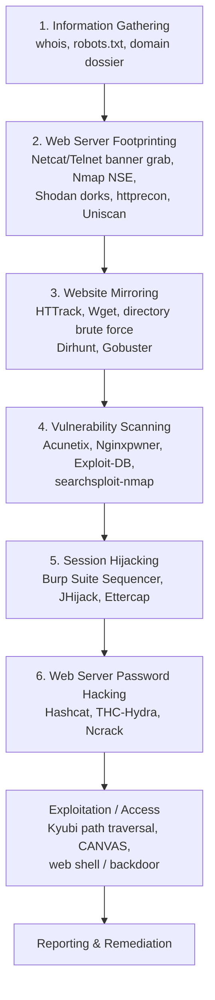

# Cheatsheet 02 — Attack ↔ Defense Methodology Map

## 1. The 6-Phase Web Server Attack Methodology

## 2. Attack → Tool → Detection Signal → Primary Countermeasure

| Attack | Primary Tool(s) | Detection Signal | Primary Countermeasure |
|---|---|---|---|
| DNS Server Hijacking | Compromised DNS admin access | DNS responses resolving to unexpected IPs; registrar alerts | Registrar-lock, DNSSEC, DNS monitoring — see [08 §8](../08-countermeasures-and-hardening.md#8-how-to-defend-against-dns-hijacking) |
| DNS Amplification (DDoS) | Botnet + open recursive resolvers | Spike in inbound UDP/53 traffic; spoofed source IPs | Disable open recursion, rate-limit, ingress filtering (BCP38) |
| Directory Traversal | Browser / curl with `../` sequences | 200 OK responses to `../../` paths in access logs | Input canonicalization, chroot/jail web root, WAF |
| Website Defacement | SQLi, stolen FTP/CMS creds | Unexpected homepage content; file-integrity alert | File Integrity Monitoring, WCDS/DirectoryMonitor — see [08 §5](../08-countermeasures-and-hardening.md#5-detecting-web-server-hacking-attempts) |
| Web Server Misconfiguration | Manual review, Nikto, Nginxpwner | Directory listing visible; verbose error pages | Harden `httpd.conf`/`php.ini`/`web.config`/`nginx.conf` — see [02 §5](../02-web-server-attack-techniques.md#5-web-server-misconfiguration) |
| HTTP Response-Splitting | Crafted CRLF payloads in params | Unexpected `Set-Cookie`/duplicate headers in logs | Strip CR/LF from user input, RFC 2616 compliance — see [08 §7](../08-countermeasures-and-hardening.md#7-how-to-defend-against-http-response-splitting-and-web-cache-poisoning) |
| Web Cache Poisoning | Response-splitting + cache probing | Unexpected cached content served to multiple users | Cache-key hardening, disable unkeyed headers |
| SSH Brute Force | THC-Hydra, Ncrack | Repeated failed auth in `/var/log/auth.log`; port-22 flood | Key-based auth, fail2ban, rate-limit, disable password auth |
| FTP Brute Force (AI-assisted) | Hydra (`-L`/`-P`) | Repeated FTP 530 login failures | Account lockout, MFA, disable anonymous FTP |
| HTTP/2 Continuation Flood | Custom HTTP/2 client sending endless CONTINUATION frames | Rapid memory/CPU growth per connection | Patch web server (HTTP/2 stack), cap header size/frame count |
| Frontjacking | CRLF/host-header injection via reverse proxy | Unexpected `Host` values reaching backend | Sanitize `$host`/`$document_uri`, pin proxy backend |
| Web Server Password Cracking | Hashcat, THC-Hydra, Ncrack | Auth log anomalies, high login-attempt rate | Strong hashing (bcrypt/scrypt/Argon2), MFA, lockout policy — see [08 §3](../08-countermeasures-and-hardening.md#3-countermeasures--protocols-and-accounts) |
| Nginx Alias Path Traversal | Kyubi | 200 OK on `../../../../etc/passwd`-style paths | Trailing-slash discipline on `location`/`alias` — see [05 §4](../05-vulnerability-scanning-and-exploitation.md#4-path-traversal-via-misconfigured-nginx-alias) |
| Session Hijacking | Burp Suite Sequencer, Ettercap | Same session ID from multiple IPs/UAs | Secure/HttpOnly/SameSite cookies, session regeneration |
| Web App attacks (SQLi/XSS/CSRF/SSRF/etc.) | sqlmap, Burp, ZAP | WAF alerts, anomalous query patterns | Input validation, parameterized queries, WAF — see **Module 14** |

## 3. Web Server Penetration-Test Checklist (OWASP-style)

Use this as a working checklist during an authorized web server engagement.

### Recon & Footprinting
- [ ] Whois / domain registration details captured
- [ ] `robots.txt` and `sitemap.xml` reviewed for hidden paths
- [ ] Server banner grabbed (Netcat/Telnet/Nmap `-sV`)
- [ ] Server identified: Apache / IIS / Nginx (+ version)
- [ ] Shodan/Censys sweep run for exposed panels & version fingerprints
- [ ] `mod_userdir` / virtual-host / subdomain enumeration attempted

### Configuration Review
- [ ] Directory listing tested on all discovered directories
- [ ] Default/sample content and admin interfaces checked (cirt.net default creds)
- [ ] HTTP methods enumerated (`TRACE`, `PUT`, `DELETE`, `OPTIONS`)
- [ ] SSL/TLS configuration checked (weak ciphers, expired/self-signed certs)
- [ ] Security headers checked (`HSTS`, `X-Frame-Options`, `X-Content-Type-Options`)
- [ ] `.htaccess` / `web.config` / `nginx.conf` reviewed if accessible

### Vulnerability & Exploitation
- [ ] Nikto / Acunetix / Nginxpwner scan completed
- [ ] Exploit-DB / searchsploit cross-referenced against identified versions
- [ ] Directory traversal tested (`../` sequences, encoded variants)
- [ ] Nginx `alias` misconfig tested where applicable (Kyubi)
- [ ] File upload functionality tested for unrestricted/unsanitized uploads
- [ ] Response-splitting / cache-poisoning tested on reflected parameters

### Authentication & Session
- [ ] Login forms tested for brute-force resistance (lockout/rate-limit)
- [ ] Session tokens analyzed for randomness/predictability (Burp Sequencer)
- [ ] Cookie flags reviewed (`Secure`, `HttpOnly`, `SameSite`)
- [ ] Default/weak credentials tested against admin interfaces

### Reporting
- [ ] Findings mapped to CVSS/severity
- [ ] Each finding mapped to a concrete remediation from [08 — Countermeasures & Hardening](../08-countermeasures-and-hardening.md)
- [ ] Retest plan defined for post-remediation validation

---

*See also: [Cheatsheet 01 — Command Quick Reference](01-command-quick-reference.md) for the exact syntax behind every tool referenced above.*
